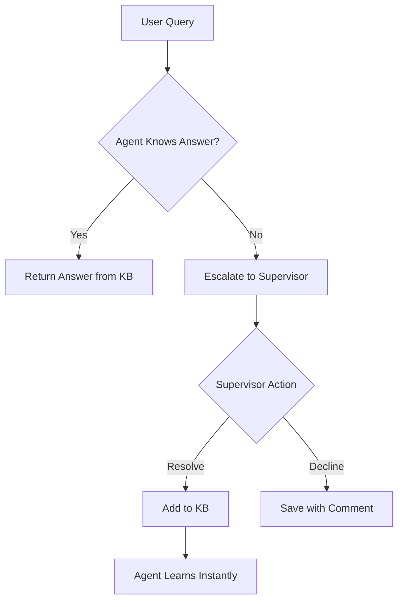

# 🏢 Frontdesk AI Supervisor System

> An intelligent, self-learning Q&A solution for service desks, reception, and automated customer support—combining machine learning, semantic search, and easy human oversight.


---

## 📋 Table of Contents

- [Features](#-features)
- [Tech Stack](#-tech-stack)
- [How It Works](#-how-it-works)
- [Installation](#-installation)
- [Usage](#-usage)
- [Project Structure](#-project-structure)
- [FAQ](#-faq)
- [Customization](#-customization--extension)
- [Contributing](#-contributing)
- [Contact](#-contact)

---

## ✨ Features

### 🤖 AI Agent
- Answers user queries by matching questions with a built-in knowledge base using semantic similarity
- Intelligent context-aware matching that handles typos and synonyms

### 🔍 Semantic Matching
- Utilizes **Sentence Transformers** (`all-MiniLM-L6-v2`) for real, context-aware matching
- Works even with typos or synonyms—no exact keyword matching required

### 📊 Supervisor Dashboard
- **Flask web UI** to resolve unknown questions, decline requests with custom reasons
- Edit the knowledge base, track stats, and search history
- Real-time statistics and audit trails

### 📚 Knowledge Base Admin
- Easily add, update, and backup Q&A pairs via the web interface
- Instant updates without server restart

### ❌ Decline with Comments
- Supervisors can provide detailed reasons for decline
- All decline reasons are saved for audit and review

### 🧠 Instant Learning
- Agent 'learns' new answers immediately after supervisor resolves
- No retraining required—updates are instant

### 🎨 Responsive UI
- Modern dashboard with intuitive design
- Includes spinner, logo, favicon, and accessibility improvements

### 🛡️ Error Handling & Backup
- Detects missing/corrupted knowledge base files
- Warns users and enables fast restore functionality

---

## 🛠️ Tech Stack

| Component | Technology |
|-----------|-----------|
| **Language** | Python 3.x |
| **Web Framework** | Flask (Supervisor panel & KB admin) |
| **ML/NLP** | Sentence Transformers (all-MiniLM-L6-v2) |
| **Frontend** | HTML, CSS, JavaScript |
| **Database** | Firebase/Firestore or any simple DB |

---

## 🔄 How It Works



1. **Agent Processing**: Agent answers known or similar questions using semantic search
2. **Escalation**: Unknown questions are escalated to the supervisor as "Pending Help Requests"
3. **Supervisor Action**: Supervisor answers (or declines) via the dashboard—updating the KB instantly
4. **Learning**: Agent can now answer those questions directly next time
5. **Audit Trail**: Declined questions are stored with supervisor comments for audit
6. **Analytics**: All actions are tracked for review and analytics

---

## 📦 Installation

### Prerequisites

- Python 3.7 or higher
- pip package manager

### Step 1: Clone the Repository

```bash
git clone <repo_url>
cd frontdesk-ai-supervisor
```

### Step 2: Install Dependencies

```bash
pip install -r requirements.txt
```

Or install manually:

```bash
pip install flask sentence-transformers python-dotenv
```

### Step 3: Configure Environment

Create a `.env.local` file in the project root (if required):

```env
OPENAI_API_KEY=your_api_key_here
```

---

## 🚀 Usage

### Run the Supervisor Panel

Start the Flask web server:

```bash
python src/supervisor_ui/app.py
```

Access the dashboard at: **http://localhost:5000**

### Run the Agent (for testing)

```bash
python src/agent/agent.py
```

> **Note**: Interact via code or extend with a chatbot interface as needed.

### Test KB Learning

1. Ask unknown questions through the agent
2. Resolve them from the supervisor dashboard
3. Ask again—see instant agent learning in action!

---

## 📁 Project Structure

```
frontdesk-ai-supervisor/
│
├── src/
│   ├── agent/
│   │   ├── agent.py              # Main agent script (user query simulation)
│   │   ├── ai_response.py        # AI response handler
│   │   ├── knowledge_base.py     # Semantic KB engine
│   │   ├── knowledge_base.json   # Editable knowledge base (Q&A pairs)
│   │   └── openai_client.py      # OpenAI client integration
│   │
│   ├── database/
│   │   ├── db_manager.py         # Database management
│   │   └── models.py             # Data models
│   │
│   ├── supervisor_ui/
│   │   └── app.py                # Supervisor dashboard and web admin
│   │
│   └── utils/
│       └── logger.py             # Logging utilities
│
├── credentials/
│   └── firebase-service-account.json
│
├── docs/                         # Documentation
├── tests/                        # Test files
├── requirements.txt              # Python dependencies
└── README.md                     # This file
```

---

## ❓ FAQ

### 1. How are questions matched?

Via semantic similarity—short and long questions are matched contextually using transformer embeddings. The system understands meaning, not just keywords.

### 2. What happens if a question can't be answered?

The agent escalates to the supervisor, who can resolve or decline. Supervisor answers are learned immediately and become available for future queries.

### 3. How does supervisor decline work?

Supervisor adds a comment when declining; the reason is shown in the dashboard for reporting and analysis. All declined requests are tracked for audit purposes.

### 4. What if the KB file becomes corrupted?

The supervisor UI catches errors, notifies the user, and supports single-click KB backup/restore functionality.

---

## 🔧 Customization & Extension

### Adjust Semantic Threshold

Modify the similarity threshold in `knowledge_base.py` for more/less flexible matching:

```python
# In knowledge_base.py
THRESHOLD = 0.7  # Adjust this value (0.0 - 1.0)
```

### Custom Branding

Swap out logo/favicon in the HTML template (`src/supervisor_ui/app.py`) for full branding customization.

### Extend Functionality

- Extend agent with chat/web interface or connect to real customer endpoints
- Add role-based access control
- Implement audit exporting (CSV, JSON)
- Add advanced analytics and reporting
- Integrate with external APIs

---

## 🤝 Contributing

Contributions are welcome! Please feel free to submit a Pull Request. For major changes, please open an issue first to discuss what you would like to change.

1. Fork the repository
2. Create your feature branch (`git checkout -b feature/AmazingFeature`)
3. Commit your changes (`git commit -m 'Add some AmazingFeature'`)
4. Push to the branch (`git push origin feature/AmazingFeature`)
5. Open a Pull Request

---

## 👤 Author & Credits

**Project by:** Kunal Sharma
**Institution:** IIIT Kota, Computer Science and Engineering
**Technical Stack:** Python, Flask, Machine Learning, UI/UX

---

## 📧 Contact

For questions, improvements, or collaborations, please contact:

📧 **Email:** [kunalsharma13579kunals@gmail.com](mailto:kunalsharma13579kunals@gmail.com)

---

## 📄 License

This project is licensed under the MIT License - see the LICENSE file for details.

---

<div align="center">

⭐ **If you find this project helpful, please consider giving it a star!** ⭐

Made with ❤️ by the Frontdesk AI Team

</div>